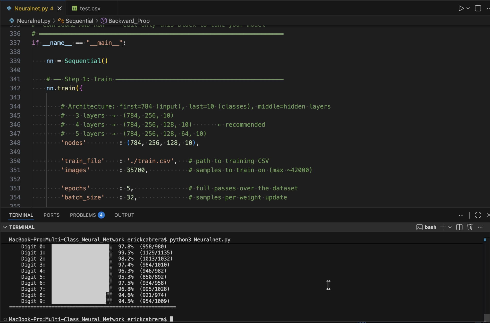
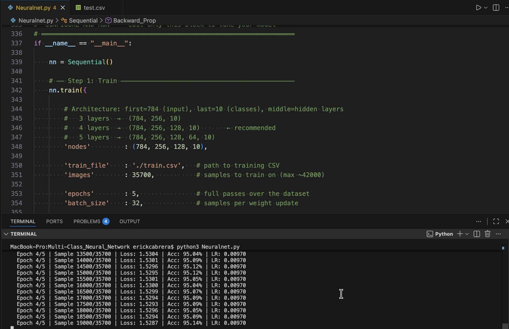

# ML Image Classifier

Engineered a multi-layer neural network from scratch using only Python and NumPy (no ML frameworks) to classify handwritten digits from the MNIST dataset, achieving over 96% test accuracy.

---

## 📋 Table of Contents

- [Prerequisites](#prerequisites)
- [Getting Started](#getting-started)
- [Running Locally](#running-locally)
- [Screenshots](#screenshots)
- [Tech Stack](#tech-stack)
- [License](#license)

---

## Prerequisites

Before you begin, ensure you have the following installed on your machine:

- [Python 3](https://www.python.org/downloads/) (latest version recommended)
- [pip](https://pip.pypa.io/en/stable/installation/) (comes bundled with Python 3)

> **Note:** To verify your Python installation, run `python3 --version` in your terminal.

---

## Getting Started

### 1. Clone the Repository

```bash
git clone https://github.com/your-username/ml-image-classifier.git
cd ml-image-classifier
```

### 2. Install Dependencies

```bash
pip install numpy pandas
```

### 3. Verify the Dataset Files

This project comes with the MNIST dataset included. Before running, confirm the following files are present in the root of the project:

```
ml-image-classifier/
├── NeuralNetV3.py
├── Train.csv
└── Test.csv
```

> **Note:** If either dataset file is missing, re-clone the repository to ensure all files were downloaded correctly.

---

## Running Locally

Once dependencies are installed and dataset files are in place, run the neural network with:

```bash
python3 NeuralNetV3.py
```

The script will train the model on `Train.csv` and evaluate its accuracy against `Test.csv`. Results and accuracy metrics will be printed to the terminal.

---

## Images

### Training Output


### Sample Predictions



## Tech Stack

| Technology | Purpose |
|---|---|
| [Python 3](https://www.python.org/) | Core programming language |
| [NumPy](https://numpy.org/) | Neural network math & matrix operations |
| [Pandas](https://pandas.pydata.org/) | Dataset loading & preprocessing |
| [MNIST Dataset](http://yann.lecun.com/exdb/mnist/) | Handwritten digit training & test data |

---

## License

© 2026 ML Image Classifier. All Rights Reserved.

This project and its source code are the exclusive property of the owner. No part of this codebase may be reproduced, distributed, modified, or used in any form without the express written permission of the owner.

Unauthorized copying, forking, or reuse of this code, in whole or in part, is strictly prohibited.
